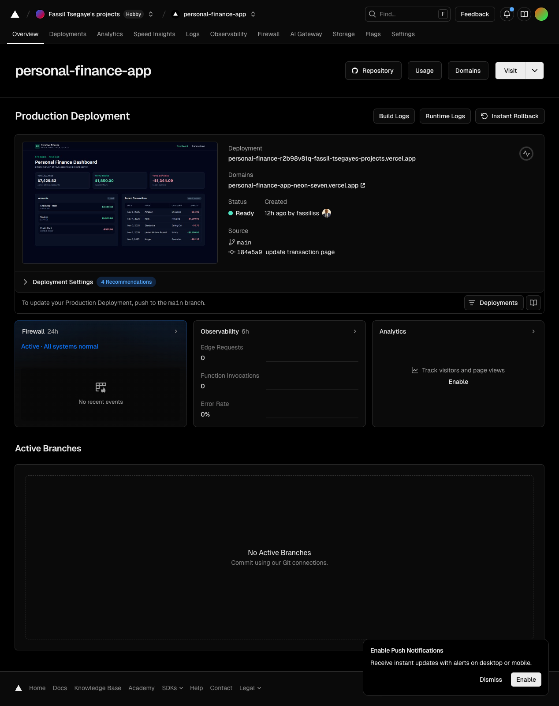
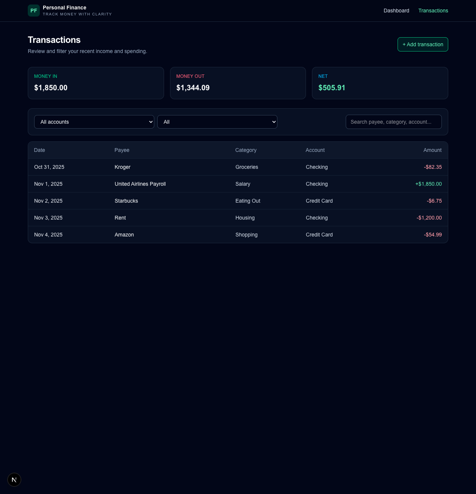

# Personal Finance App 💸

A modern personal finance dashboard built with **Next.js 16**, **TypeScript**, and **Tailwind CSS**.  
Track your income, expenses, and account balances with clarity.

---

## ✨ Features

- 📊 **Dashboard**
  - Total balance
  - Total income & expenses
  - Account overview
  - Recent transactions

- 💳 **Transactions**
  - Filter by account & type
  - Search by payee, category, or account
  - Real-time totals (inflow, outflow, net)

- ➕ **Add Transactions**
  - Structured transaction form
  - Shared state across pages

- 🧠 **State Management**
  - Central finance store
  - Single source of truth for accounts & transactions

- 🎨 **UI & UX**
  - Clean dark theme
  - Responsive layout
  - Sticky navigation

---

## 🖥️ Screenshots

### Dashboard


### Transactions


---

## 🛠 Tech Stack

- **Framework:** Next.js 16 (App Router)
- **Language:** TypeScript
- **Styling:** Tailwind CSS
- **State Management:** Custom React store
- **Routing:** App Router (`/app`)
- **Deployment:** Vercel
- **Version Control:** Git & GitHub

---

## 🚀 Getting Started

Clone the repository:

```bash
git clone https://github.com/fassiliss/personal-finance-app.git
cd personal-finance-app

